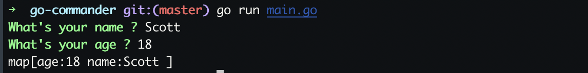

# go-commander
A commander tool written with go

### useage
```
# install
gopm get -g -v -u github.com/scott-x/gcmd
```
### API
- func AddQuestion(Name,Tip,ReTip,Re) *Questions
- func Exec() map[string]string //the example code here is answers

### Code Example
```
package main

import (
	"github.com/scott-x/gcmd"
	"fmt"
)
func main(){
   gcmd.AddQuestion("name","What's your name ? ","Please input correct name: ","[a-z]+")
   gcmd.AddQuestion("age","What's your age ? ","Please input correct age: ","[0-9]{2}")
   answers :=gcmd.Exec()
   fmt.Println(answers) 
   //anycode here ...
}   

```
### A REFERENCE IMAGE

